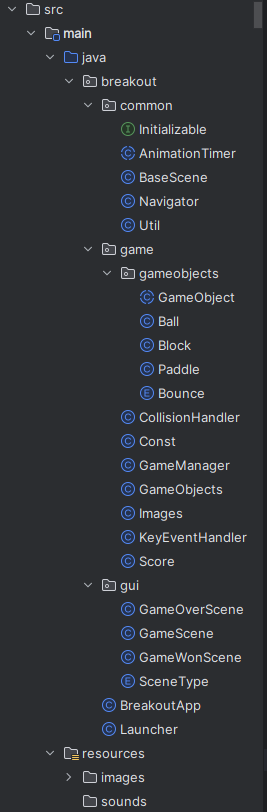
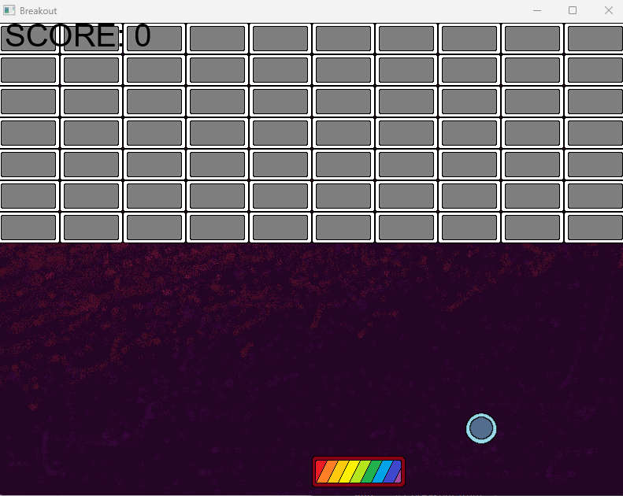

  
<h1>
Breakout Game in Javafx
</h1>
<h6>Antoni Wolski & Melvin Kampus</h6>

---

<h2>Inhaltsverzeichnis</h2>

- ### [Planung](#Abschnitt-1)
  - [Vorgehen](#Abschnitt-1-1)
  - [Abstract](#Abschnitt-1-2)
  - [Userstories](#Abschnitt-1-3)
  - [Git](#Abschnitt-1-4)
  
- ### [Positive Punkte](#Abschnitt-2)
  - [Struktur](#Abschnitt-2-1)
  - [Logik](#Abschnitt-2-2)

- ### [Negative Punkte](#Abschnitt-3)
  - [Schwierigkeiten mit fxml](#Abschnitt-3-1)
  
- ### [Umsetzung im Team](#Abschnitt-4)

- ### [Produkt](#Abschnitt-5)

- ### [Fazit](#Abschnitt-6)
  - [Was nehmen wir mit für unsere Lehre?](#Abschnitt-6-1)
  - [Was könnte besser sein?](#Abschnitt-6-2)

 

---

<h2>Planung</h2>

- <h3>Vorgehen</h3>
  
  Der **erste Punkt** den wir behandelt haben, war was wir überhaupt machen wollten, 
  eine App oder ein Game?
  
  **Wir entschieden uns für ein Game**, dies warf jedoch gleich weitere Fragen auf,  
  wollten wir ein eigenes 
  **Game erfinden** oder ein bereits existierendes nachbauen? 
  
  Aufgrund des bestehenden **Zeitdrucks**, haben wir uns für letzteres entschieden.
  
  Deshalb haben wir uns dazu entschieden das Arcade Game **Breakout (Original von Atari)** zu bauen.

- <h3>Abstract</h3>

  Breakout ist ein klassisches Arcade-Spiel, das in den 1970er Jahren von Atari entwickelt wurde. 

  Das Ziel des Spiels ist es, mit einem beweglichen Paddle einen Ball abprallen zu lassen, 

  um damit eine Wand aus farbigen Blöcken oberhalb des Bildschirms zu zerstören. Der Spieler steuert das Paddle horizontal, 
  
  um den Ball im Spiel zu halten und ihn in Richtung der Blöcke zu lenken. Jeder getroffene Block verschwindet und bringt Punkte ein. 
  
  Das Spiel wird schwieriger, da der Ball schneller wird und neue Herausforderungen wie bewegliche Barrieren eingeführt werden. Das Ziel ist es, 
  
  alle Blöcke zu zerstören, ohne den Ball zu verlieren, um so viele Punkte wie möglich zu sammeln.

- <h3>Userstories</h3>

- [x] Als Spieler möchte ich das Paddle mit den Pfeiltasten   nach links und rechts bewegen können.
- [x] Als Spieler möchte ich, dass der Ball von den Edges sowie den Blöcken abprallt.
- [x] Als Spieler möchte ich, dass die Blöcke zerstört werden, wenn der Ball sie trifft.
- [x] Als Spieler möchte ich, dass ich verliere, wenn der Ball den unteren Edge berührt. 
- [x] Als Spieler möchte ich einen Score haben, der zählt wie viele Punkte ich habe.
- [x] Als Spieler möchte ich, dass die Geschwindigkeit des Balls steigt, je mehr Blöcke zerstört werden.

***Optionale Ziele:***

- [ ] Als Spieler möchte ich, dass Blöcke von verschiedener Farbe, verschiedene Anzahl Treffer brauchen, um zerstört zu werden.
- [ ] Als Spieler möchte ich, dass mein Highscore unter meinem Namen gespeichert wird.
- [ ] Als Spieler möchte ich Booster erhalten
- [ ] Als Spieler möchte ich mit Blöcken herausgefordert werden, die nicht zerstört werden dürfen.
- [ ] Als Spieler möchte ich entweder durch den Score oder individuell eine Währung sammeln können und damit Booster und/oder Designs/Farben freischalten kann

- ### Git
  
  Wir haben mit **Gitlab** gearbeitet und jeweils für die einzelnen Userstories einen Branch erstellt, um nichts an
  
  der funktionierenden **main** Branch zu verändern und mögliche Fehler verhindern. Wenn wir in den eigenen development Branches
  
  einen laufenden Code mit unseren Änderungen hatten, haben wir sie in die **main** Branch gemerged. So konnten wir schnell
  
  und effizient ein funktionierendes Breakout Game bauen.

 

---

## Positive Punkte

- ### Struktur

  

- ### Logik

  Die Logik des Games funktioniert gut und der Code ist gut lesbar, weshalb es für uns leicht war
  
  im Team zu arbeiten. Wir konnten beliebig Aufgaben verteilen, denn durch unsere übersichtliche Struktur
  
  und dem gut lesbaren Code konnte man diesen ohne viel über den Rest zu wissen anpassen und verändern.

---

## Negative Punkte

- ### Schwierigkeiten mit fxml

  Wir haben versucht mit **fxml** (Markup Language), das Gerüst für unsere GUI zu erstellen, denn fxml hat ein **scene builder Tool**,
  
  mit dem man die Buttons, Labels usw. einfach platzieren konnte und der Code automatisch geschrieben wurde. Das Problem war
  
  jedoch, die GUI mit der Gamelogik zu verbinden. Wir haben probiert die GUI zuerst ausserhalb von unserem Projekt zu bauen 
  
  und dann im Projekt zu implementieren, doch leider hat das nicht so ganz geklappt. Dabei stört uns am meisten, dass wir nicht einmal
  
  herausfinden konnten **weshalb** es nicht funktionierte.

---

## Umsetzung im Team
  Das Arbeiten im Team hat sehr gut funktioniert. Wir haben zu Beginn ein Issue board in Gitlan erstellt und dieses mit unseren
  Userstories gefüllt. 
   
  So konnten wir selbst entscheiden wer was macht und die Aufgaben gut verteilen. Im Allgemeinen haben
  wir sehr gut als Team funktioniert, 
    
  wir konnten uns bei Problemen gegenseitig aushelfen und haben schnell Lösungen für
  Probleme finden wenn wir verschiedene Vorstellungen hatten.

---

## Produkt

---

## Fazit

- ### Was nehmen wir mit für unsere Lehre?
  Auf jeden Fall haben wir viel dazugelernt, wie man zum Beispiel in einem Team an einem 
  
  einzelnen Projekt, ohne sich in den Weg zu kommen arbeiten kann

  und dazu noch effizienter Ideen und Aufgaben umsetzt. 

- ### Was könnte besser sein?

  Wir sind der Meinung, dass an sich die Logik des Games gut oder zumindest wie geplant geworden ist und wir aufgrund der
  
  beschränkten Zeit nicht besonders viel an z.B. der GUI machen konnten, denn wir wollten uns auf das eigentliche Game 
  
  fokussieren. 
