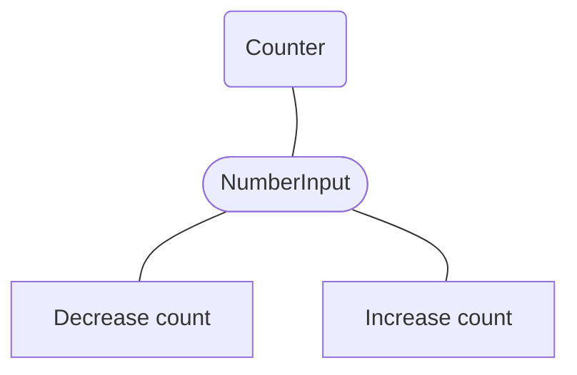

# Expo React Native - CounterApp

Basic React Native mobile app, provides counter component. Counter can either be **increased** by clicking the *Increase count* button (counterValue++) or **decreased** by clicking the *Decrease count* button (counterValue--)
## Components

- **Counter:** Contains the display of the current value of the number.  *(default: 0)*
- **NumberInput:** Contains an input field for entering a number. Is used to specify a maximum value. The user should only be able to enter numbers (no letters). A label for the caption should also be displayed. *(default: blank)*
- **AppButton:** The user should be able to perform an action using the AppButton. (Increasing and decreasing the number) *(Increase count, Decrease count)*

